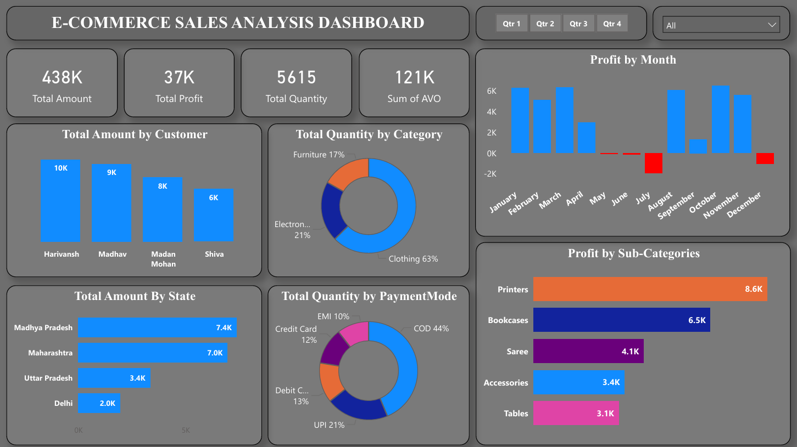

# 📊 E-Commerce Sales Dashboard | Power BI

This project presents an interactive **E-Commerce Sales Analysis Dashboard** built using **Power BI**, focused on extracting meaningful business insights from raw sales data.
## 🔍 Dashboard Preview

## 🔍 Project Overview

The dashboard analyzes overall business performance through key metrics and visualizations, enabling effective data-driven decision making.

## ✅ Key Features

* Total Sales, Profit, Quantity, and Average Order Value (AOV)
* Monthly profit trend analysis
* Sales breakdown by customer and state
* Category and sub-category performance
* Payment mode distribution
* Interactive slicers and filters for dynamic exploration

## 🛠 Tools & Technologies

* Power BI
* DAX
* Data Modeling
* Excel / CSV Dataset

## 🎯 Objectives

* Transform raw transactional data into actionable insights
* Build clean and interactive business dashboards
* Practice real-world KPI reporting and analytics
* Strengthen Power BI and DAX skills

## 📌 Outcome

The dashboard provides a clear view of sales performance and customer behavior, helping stakeholders understand trends, identify opportunities, and make informed decisions.

---

📂 *Feel free to explore the project and share feedback or suggestions.*
